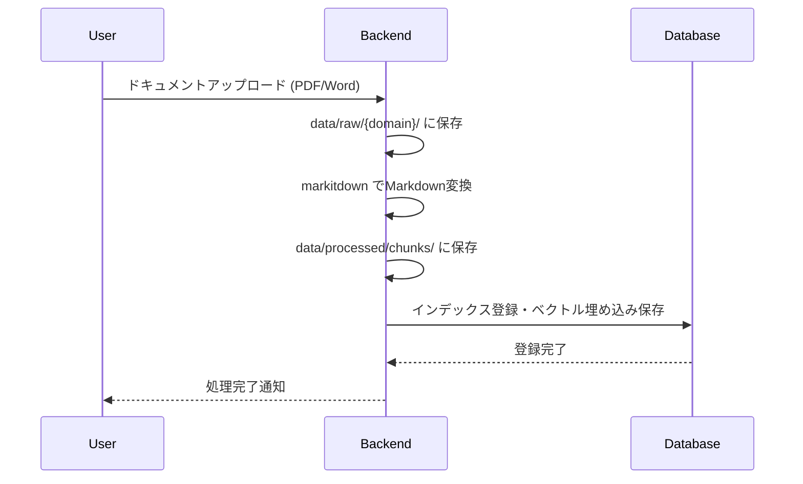
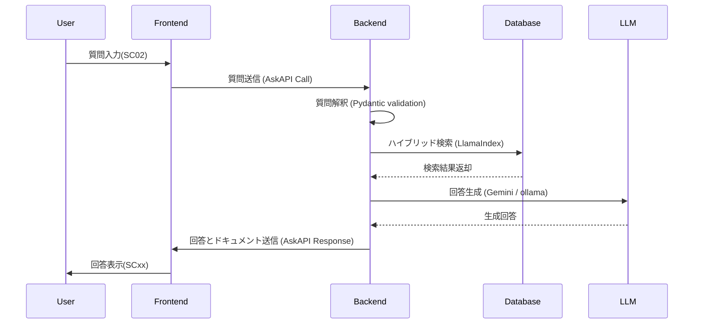

# Overview

- このシステムは、ユーザーからの質問に対して適切な回答を生成し、関連するドキュメントを検索・提示することを目的としています。
- フロントエンド・バックエンドを分離するアーキテクチャを採用し、型安全性を重視した設計となっています。

# Architecture Components

| Component | Description | Technology |
|-----------|-------------|------------|
| Frontend | ユーザーインターフェース<br>質問の入力と回答の表示を担当 | Next.js (App Router), React, TypeScript, Zustand |
| Backend | ドキュメント処理、ハイブリッド検索、インデックス登録、回答生成 | Python 3.12, FastAPI, Pydantic v2, LlamaIndex, markitdown |
| Database | チャンク化済みテキストの保存 | Neo4j |
| LLM | 回答生成・質問解釈 | Gemini API / ollama (ローカルLLM) |

# Type Safety

| Layer | Technology | Description |
|-------|------------|-------------|
| Backend | Pydantic v2 | ランタイム検証 + 静的型ヒント |
| Frontend | TypeScript (strict mode) | 静的型チェック |
| API Contract | OpenAPI Schema | FastAPI自動生成スキーマ |

# Data Flow

## Document Processing Flow (ドキュメント処理フロー)



## Question Answering Flow (質問応答フロー)



# Data Storage

```
data/
├── raw/                    # 元ドキュメント
│   ├── papers/
│   ├── notes/
│   └── datasets/
├── processed/              # チャンク化・埋め込み済み
│   ├── chunks/
│   └── metadata/
├── feedback/               # フィードバックデータ
└── logs/                   # アプリケーションログ
```

# Containerization

- システム全体はDockerコンテナで管理され、各コンポーネントは独立してデプロイ可能です。
- Docker Composeを使用して、ローカル環境での開発・テストを容易にしています。

| Container | Role | Image | Description |
|-----------|------|-------|-------------|
| frontend | ユーザーインターフェース | `node:22-slim` | Next.jsアプリケーション |
| backend | APIサーバー | `python:3.12-slim` | FastAPIアプリケーション (uv管理) |
| database | ドキュメント保存 | `neo4j:5` | Neo4jデータベース |
| ollama | ローカルLLMホスティング | `ollama/ollama:latest` | ローカルLLMサーバー（オプション） |

# Package Management

| Layer | Tool | Config File |
|-------|------|-------------|
| Backend | uv | `pyproject.toml`, `uv.lock` |
| Frontend | npm | `package.json`, `package-lock.json` |

# Scalability and Future Enhancements

- 将来的なスケーリングを考慮し、各コンポーネントはマイクロサービスアーキテクチャに適応可能です。
- Phase 3ではLangGraph/LangChainによるマルチエージェントオーケストレーションを検討。

# Directory Structure

以下のファイルに記載しています。
[project_structure](./project_structure.md)
