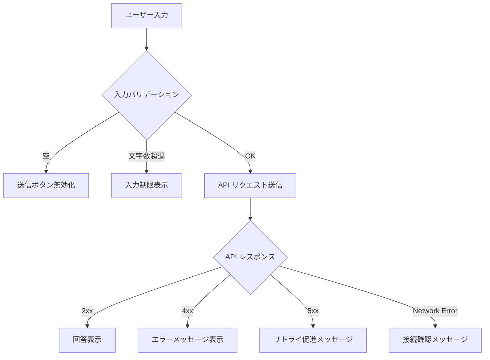
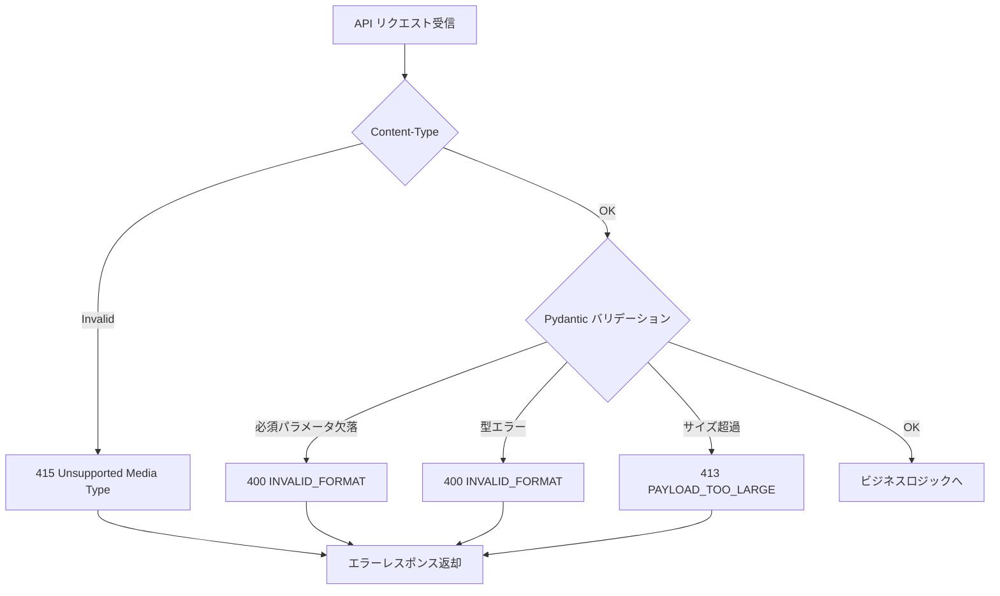
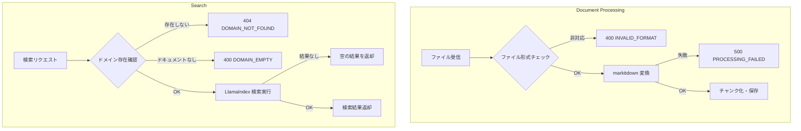
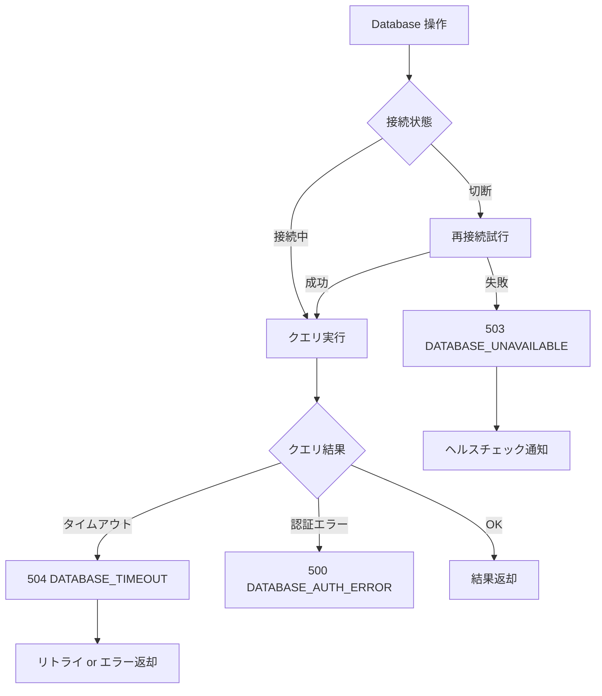
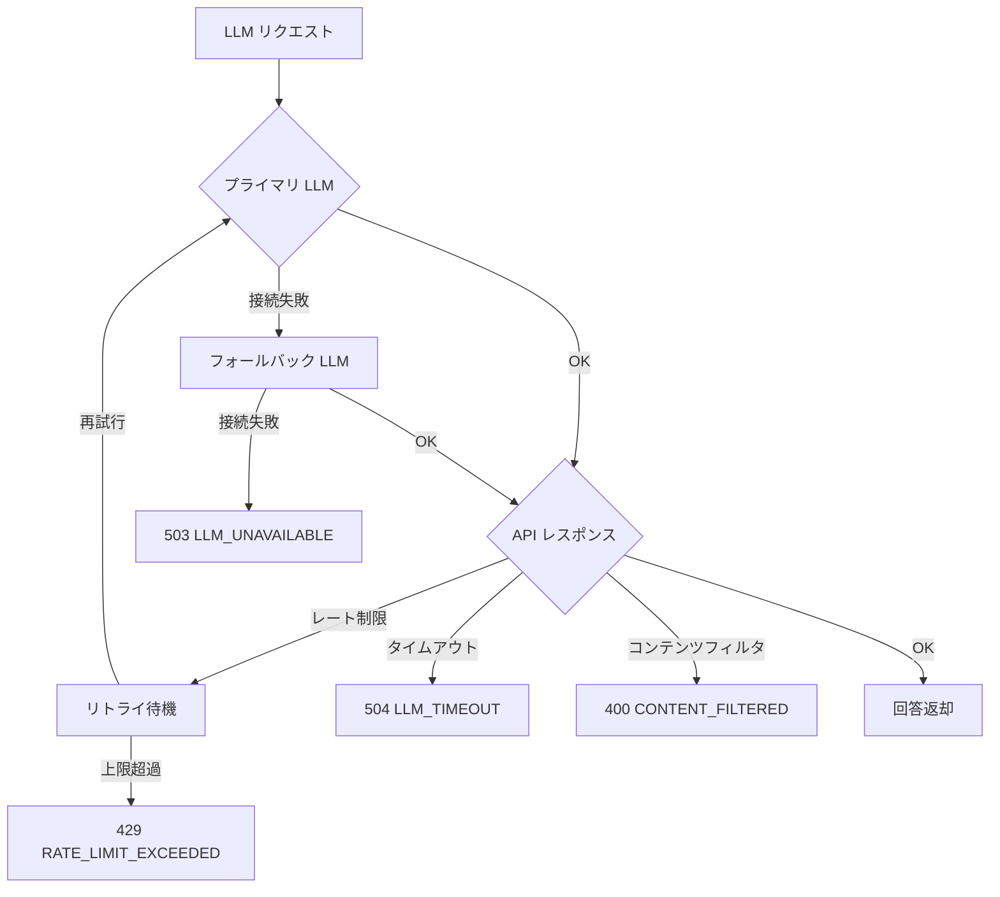
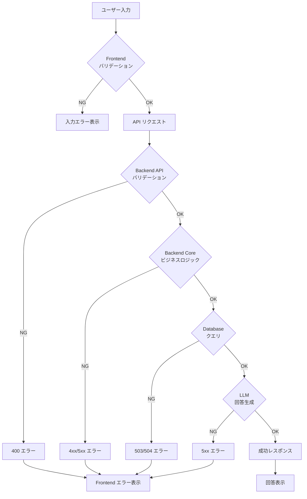

# Overview

このプロジェクトでのエラーハンドリングの方針と実装について説明します。

## Error Handling Strategy

エラーは発生箇所に応じて適切にハンドリングし、ユーザーに分かりやすいメッセージを返します。

---

## 1. Frontend (入力バリデーション・UI)

### 対象エラー
- ユーザー入力の形式エラー
- API レスポンスエラーの表示
- ネットワークエラー

### Error Flow

### ハンドリング方針
| エラー種別 | 対応 | ユーザーへの表示 |
|-----------|------|-----------------|
| 入力が空 | 送信ボタン無効化 | 「質問を入力してください」 |
| 入力文字数超過 | 入力制限 | 「1000文字以内で入力してください」 |
| API 4xx エラー | エラーメッセージ表示 | API から返却されたメッセージ |
| API 5xx エラー | リトライ促進 | 「サーバーエラーが発生しました」 |
| ネットワークエラー | 接続確認促進 | 「ネットワーク接続を確認してください」 |

---

## 2. Backend API (リクエストバリデーション)

### 対象エラー
- リクエストボディの形式エラー
- 必須パラメータの欠落
- パラメータの型・範囲エラー

### Error Flow

### ハンドリング方針
| エラー種別 | HTTP Status | Error Code |
|-----------|-------------|------------|
| 必須パラメータ欠落 | 400 | `INVALID_FORMAT` |
| パラメータ型エラー | 400 | `INVALID_FORMAT` |
| リクエストサイズ超過 | 413 | `PAYLOAD_TOO_LARGE` |

---

## 3. Backend Core (ビジネスロジック)

### 対象エラー
- ドキュメント処理エラー
- 検索エラー
- 回答生成エラー

### Error Flow

### ハンドリング方針
| エラー種別 | HTTP Status | Error Code |
|-----------|-------------|------------|
| 非対応ファイル形式 | 400 | `INVALID_FORMAT` |
| ドキュメント変換失敗 | 500 | `PROCESSING_FAILED` |
| ドメイン未存在 | 404 | `DOMAIN_NOT_FOUND` |
| ドメインにドキュメントなし | 400 | `DOMAIN_EMPTY` |

---

## 4. Database (Neo4j 接続・クエリ)

### 対象エラー
- 接続エラー
- クエリ実行エラー
- タイムアウト

### Error Flow

### ハンドリング方針
| エラー種別 | HTTP Status | Error Code |
|-----------|-------------|------------|
| 接続失敗 | 503 | `DATABASE_UNAVAILABLE` |
| クエリタイムアウト | 504 | `DATABASE_TIMEOUT` |
| 認証エラー | 500 | `DATABASE_AUTH_ERROR` |

---

## 5. LLM (Gemini API / ollama)

### 対象エラー
- API 接続エラー
- レート制限
- モデル応答エラー

### Error Flow

### ハンドリング方針
| エラー種別 | HTTP Status | Error Code |
|-----------|-------------|------------|
| API 接続失敗 | 503 | `LLM_UNAVAILABLE` |
| レート制限 | 429 | `RATE_LIMIT_EXCEEDED` |
| タイムアウト | 504 | `LLM_TIMEOUT` |
| コンテンツフィルタ | 400 | `CONTENT_FILTERED` |

---

## System Error Flow (全体像)

---

## Error Codes Summary

| Code | HTTP Status | Description |
|------|-------------|-------------|
| `INVALID_FORMAT` | 400 | リクエストフォーマットが不正 |
| `DOMAIN_NOT_FOUND` | 404 | 指定されたドメインが存在しない |
| `DOMAIN_EMPTY` | 400 | ドメインにドキュメントが存在しない |
| `DOCUMENT_NOT_FOUND` | 404 | ドキュメントIDが見つからない |
| `PROCESSING_FAILED` | 500 | ドキュメント処理に失敗 |
| `DATABASE_UNAVAILABLE` | 503 | データベースに接続できない |
| `DATABASE_TIMEOUT` | 504 | データベースクエリがタイムアウト |
| `LLM_UNAVAILABLE` | 503 | LLMサービスが利用不可 |
| `LLM_TIMEOUT` | 504 | LLM応答がタイムアウト |
| `RATE_LIMIT_EXCEEDED` | 429 | レート制限超過 |
| `CONTENT_FILTERED` | 400 | コンテンツがフィルタリングされた |
