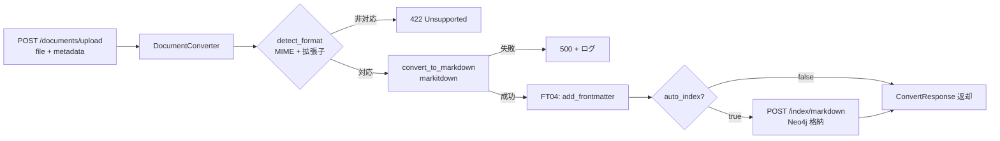

# FT03: Document Processing - Design Document

## Overview

**Feature ID**: FT03
**Feature Name**: ドキュメント処理 (Document Processing)
**Description**: アップロードされたドキュメント(JSON, PDF, JPEG/PNG等)をMarkdown形式に変換・正規化する機能
**Implementation Phase**: Sprint 2 (Issue #23)
**Library**: [markitdown](https://github.com/microsoft/markitdown) (Microsoft製のPythonライブラリ)

## Objectives

1. 対応フォーマット（JSON/PDF/JPEG/JPG/PNG）をMarkdown形式に変換する
2. MIME タイプ + 拡張子でファイル種別を判定する
3. 変換後のMarkdownをFrontmatter付与処理（FT04）に渡す
4. 変換エラーを適切にハンドリングし、ログを記録する

## Out of Scope

- 非同期ジョブ基盤（Celery 等）の導入
- Office 全形式（DOCX/XLSX/PPTX 等）の対応
- ファイルのディスク保存（Markdownテキストとして返却するのみ）

## Supported Formats

| Format | MIME Type | Extension |
|--------|-----------|-----------|
| JSON   | application/json | .json |
| PDF    | application/pdf  | .pdf  |
| JPEG   | image/jpeg       | .jpg / .jpeg |
| PNG    | image/png        | .png  |

## Architecture Design

### Module Structure

```
backend/src/lakda/
├── api/documents.py                  # POST /documents/upload エンドポイント
├── services/documents/
│   ├── __init__.py
│   └── converter.py                  # DocumentConverter クラス
└── models/schemas/
    └── documents.py                  # UploadRequest / ConvertResponse
```

### Data Flow



### API Endpoint

```
POST /documents/upload
  Request: multipart/form-data
    - file:        UploadFile  (JSON/PDF/JPEG/PNG)
    - domain:      str         (default: "general")
    - tags:        list[str]   (optional)
    - title:       str         (optional)
    - auto_index:  bool        (default: false)

  Response 200: ConvertResponse
    - doc_id:    str
    - markdown:  str   (Frontmatter 付き Markdown)
    - format:    str
    - indexed:   bool

  Response 422: Unsupported format
  Response 500: Conversion failure
```

### DocumentConverter Class

```python
# backend/src/lakda/services/documents/converter.py

class DocumentConverter:
    def detect_format(self, file_bytes: bytes, filename: str) -> str:
        """
        MIME タイプ + 拡張子でフォーマット判定。
        非対応フォーマットの場合は ValueError を raise。
        """

    def convert_to_markdown(self, file_bytes: bytes, fmt: str) -> str:
        """
        markitdown を使用して Markdown に変換。
        変換失敗時は RuntimeError を raise。
        """
```

## Technology Selection

### markitdown Library

Microsoft製のPythonライブラリで、以下の特徴を持つ:

**サポートフォーマット（本機能で使用するもの）**:
- PDF (.pdf)
- 画像 (.jpg, .png) - OCR機能あり
- JSON (.json)

**特徴**:
- シンプルなAPI (`MarkItDown().convert_stream(stream, file_extension=ext)`)
- Pythonライブラリとして直接importして使用可能

### python-magic Library

MIME タイプ判定に使用。拡張子のなりすまし（例: .pdf に偽装した PNG）を防ぐ。

## Dependencies

```toml
# pyproject.toml（既存）
"markitdown>=0.1.4"

# 追加
"python-magic>=0.4.27"
```

## Testing Strategy

```
backend/tests/
├── services/documents/
│   └── test_converter.py         # detect_format / convert_to_markdown
└── api/
    └── test_documents_api.py     # POST /documents/upload エンドポイント
```

テストケース:
- 各フォーマット（JSON/PDF/JPEG/PNG）が正しく変換される
- 非対応フォーマット（.docx 等）は 422 を返す
- 変換失敗時は 500 + ログ出力される
- MIME タイプと拡張子の不一致を検出できる

## Error Handling

| Error Type | HTTP Status | Handling |
|-----------|-------------|----------|
| Unsupported format | 422 | 対応フォーマットリストを返却 |
| Conversion failure | 500 | エラーメッセージ + doc_id でログ追跡可能 |
| File too large | 413 | サイズ上限超過メッセージを返却 |

## Integration with FT04

変換後のMarkdownはそのままFT04の `add_frontmatter()` に渡される。

```python
# api/documents.py 内の処理フロー
converter = DocumentConverter()
fmt = converter.detect_format(file_bytes, file.filename)
markdown = converter.convert_to_markdown(file_bytes, fmt)
markdown_with_meta = converter.add_frontmatter(markdown, meta)  # FT04
```

## Acceptance Criteria

- [ ] 対象4形式（JSON/PDF/JPEG/PNG）を受け付けてMarkdown変換できる
- [ ] MIME タイプ + 拡張子でファイル種別を正しく判定できる
- [ ] 非対応フォーマットは 422 を返す
- [ ] 変換失敗時は 500 と追跡可能なログを出力する
- [ ] 単体テストが実装され、全てパスする
- [ ] 結合テスト（upload → convert → metadata → index）が実装される

## Changelog

| Date | Version | Changes |
|------|---------|---------|
| 2026-03-25 | 2.0 | Sprint 2 (Issue #23) に合わせて全面改訂。CLI廃止、FastAPI エンドポイントに移行。対応フォーマットを JSON/PDF/JPEG/PNG に限定。 |
| 2026-01-01 | 1.1 | CLIをargparseからclickに変更 |
| 2026-01-01 | 1.0 | 初版作成 |
