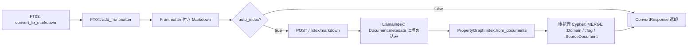

# Feature Design: FT04 - ドキュメントメタデータ付与 (Frontmatter Enrichment)

## 1. 機能概要 (Overview)

FT03で変換されたMarkdownドキュメントに対し、YAML Frontmatterとしてメタデータを付与する。
付与されたメタデータはindex APIを通じてNeo4jのメタデータノードとして格納される。

**今Sprintのスコープ**: バックエンドのFrontmatter付与ロジックとNeo4jノード登録のみ。
フロントエンドUIは対象外。

## 2. Frontmatter スキーマ

```yaml
---
domain: "general"           # 必須: 検索ドメイン（Neo4j :Domain ノードに対応）
tags: []                    # オプション: タグリスト（Neo4j :Tag ノードに対応）
title: "document title"     # オプション（未指定時は source_file のステム）
created_at: "2026-03-25"    # 自動付与: 変換日時
source_file: "sample.pdf"   # 自動付与: 元ファイル名（Neo4j :SourceDocument ノードに対応）
---
```

### フィールド定義

| Field | Type | Required | Source |
|-------|------|----------|--------|
| domain | str | 必須 | リクエストパラメータ（default: "general"） |
| tags | list[str] | オプション | リクエストパラメータ |
| title | str | オプション | リクエストパラメータ（未指定時は source_file のステム） |
| created_at | str (ISO 8601) | 自動 | 変換実行時の日時 |
| source_file | str | 自動 | アップロードされたファイル名 |

## 3. Neo4j ノード設計

### 実装方針: LlamaIndex Document metadata + 後処理 Cypher

Frontmatter の値を LlamaIndex の `Document.metadata` に乗せてインデキシングする。
LlamaIndex が各チャンクノードにメタデータを伝播させた後、`Neo4jGraphStoreManager.execute_query()` で後処理 Cypher を実行してメタデータノードを作成・接続する。

**Cypher の具体的なプロパティ名はインデキシング後の実ノード構造を確認して確定する。**

### インデキシング時: Document.metadata への埋め込み

```python
# services/index/service.py（既存の pipeline.py 呼び出し箇所を拡張）

from llama_index.core import Document

doc = Document(
    text=markdown,           # Frontmatter 付き Markdown
    metadata={
        "doc_id":      doc_id,
        "domain":      meta.domain,
        "tags":        meta.tags,        # list[str]
        "source_file": meta.source_file,
        "created_at":  meta.created_at,
    }
)
# 既存の PropertyGraphIndex.from_documents([doc]) に渡す
```

### 後処理 Cypher: メタデータノードの作成・接続

LlamaIndex によるインデキシング完了後、以下の Cypher をまとめて実行する。

#### :Domain

```cypher
MATCH (c {metadata: {domain: $domain}})
MERGE (d:Domain {name: $domain})
MERGE (c)-[:BELONGS_TO]->(d)
```

- 複数ドキュメントが同一ドメインを共有できる

#### :Tag

```cypher
UNWIND $tags AS tag
MATCH (c {metadata: {source_file: $source_file}})
MERGE (t:Tag {name: tag})
MERGE (c)-[:HAS_TAG]->(t)
```

- `tags` リストの各要素に対してノードを生成

#### :SourceDocument

```cypher
MERGE (s:SourceDocument {source_file: $source_file})
SET s.created_at = $created_at, s.updated_at = $updated_at
WITH s
MATCH (c {metadata: {source_file: $source_file}})
MERGE (c)-[:FROM_SOURCE]->(s)
```

- 同一ファイルの再処理時は `updated_at` のみ更新（冪等）

> **Note**: 上記 Cypher のノードマッチ条件（`metadata` プロパティのアクセス方法）は、
> LlamaIndex が Neo4j に格納する実際のノード構造を確認してから確定する。

### グラフ構造イメージ

```
(:SourceDocument {source_file: "sample.pdf", created_at: ..., updated_at: ...})
    ↑ FROM_SOURCE
(:Chunk {text: "...", doc_id: "...", domain: "general", ...})
    ↓ BELONGS_TO
(:Domain {name: "general"})

(:Chunk)-[:HAS_TAG]->(:Tag {name: "architecture"})
(:Chunk)-[:HAS_TAG]->(:Tag {name: "api"})
```

## 4. Frontmatter 付与ロジック

### 冪等性（重複付与防止）

同一ドキュメントを再処理した場合でも、Frontmatterが二重化しないようにする。

```python
def is_frontmatter_present(markdown: str) -> bool:
    """先頭が --- で始まる場合は既存Frontmatterありと判定。"""
    return markdown.lstrip().startswith("---")

def add_frontmatter(markdown: str, meta: FrontmatterMeta) -> str:
    """
    Frontmatter を付与する。
    既存Frontmatterがある場合はスキップ（冪等）。
    """
    if is_frontmatter_present(markdown):
        return markdown
    frontmatter = yaml.dump(meta.model_dump(), allow_unicode=True, sort_keys=False)
    return f"---\n{frontmatter}---\n\n{markdown}"
```

### FrontmatterMeta スキーマ

```python
# backend/src/lakda/models/schemas/documents.py

class FrontmatterMeta(BaseModel):
    domain: str = "general"
    tags: list[str] = []
    title: Optional[str] = None
    created_at: str  # ISO 8601
    source_file: str
```

## 5. FT03・index API との連携フロー



## 6. 担当コンポーネント (Components)

- **Backend**: Frontmatter付与ロジック (`services/documents/converter.py`)
- **Backend**: Neo4jノード登録 (`services/index/pipeline.py` に拡張)
- **State Management**: 今Sprintはスコープ外

## 7. Acceptance Criteria

- [ ] 変換済みMarkdownに必須Frontmatterが付与される
- [ ] 同一ドキュメント再処理でもFrontmatterが二重化しない
- [ ] メタデータ付きMarkdownがNeo4jに格納される
- [ ] `:Domain` / `:Tag` / `:SourceDocument` ノードがMERGEで作成される
- [ ] 単体テスト（Frontmatter付与・冪等性）が全てパスする
- [ ] 結合テスト（upload → convert → metadata → index）が実装される

## Changelog

| Date | Version | Changes |
|------|---------|---------|
| 2026-03-25 | 2.0 | Sprint 2 (Issue #23) に合わせて全面改訂。UI設計を削除しバックエンド設計に集中。Frontmatterスキーマ・Neo4jノード設計を追加。 |
| 2026-01-01 | 1.0 | 初版作成 |
