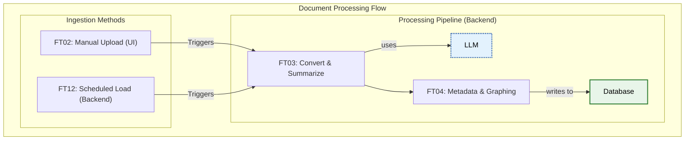

# Features

|feature id| name | Component | description | input | output |
|---|---|---|---|---|---|
|FT01|質問入力|Frontend|Web UIからドメイン固有の質問を入力|テキスト形式の質問、オプションでドメイン指定|質問文字列 (APIリクエスト)|
|FT02|ドキュメントアップロード|Frontend<br>Backend|Web UIからPDF/Word/Markdown/テキストファイルをアップロードし、Backendで保存|PDF, DOCX, MD, TXTファイル|`data/uploads/`に保存|
|FT03|ドキュメント処理|Backend|アップロードされたファイルをMarkdownに変換|PDF/Wordファイル|`data/documents/{domain}/`にMarkdown保存|
|FT04|ドキュメント<br>メタデータ付与|Backend<br>LLM|ドキュメントにFrontmatter追加（ドメイン分類、タグ）|Markdownファイル|Frontmatter付きMarkdownファイル|
|FT05|ドキュメント修正|Frontend|ユーザーがドキュメント内容を修正可能にする|LLMによるメタデータ・要約付き<br>Markdownファイル|修正済みMarkdown文字列|
|FT06|質問解釈|Backend<br>LLM|曖昧な質問を具体化|質問文字列|解釈された質問文字列|
|FT07|質問修正|Frontend|ユーザーが質問内容を修正可能にする|LLMによる質問解釈が<br>行われた質問文字列|LLMの確認に対しての返答|
|FT08|グラフ探索|Backend<br>LLM|LlamaIndexを用いてナレッジグラフ探索を行う|具体化された質問文字列|関連情報リスト|
|FT09|回答生成|Backend|検索結果から引用元付き回答を生成|関連情報リスト|回答本文<br>引用元リスト<br>(APIレスポンス)|
|FT10|回答出力|Frontend|生成された回答をWeb UIに表示|回答本文<br>引用元リスト|Web UI表示|
|FT11|フィードバック記録|Frontend<br>Backend|ユーザーの回答評価をWeb UIから送信し、Backendで記録|回答評価入力|`data/feedback/`にログを保存<br>LlamaIndexの`PropertyGraphIndex`で保存|
|FT12|定期ドキュメント読み込み|Backend|ディレクトリを定期監視し、新規・更新ドキュメントを自動処理|監視対象ディレクトリ|`LlamaIndex.PropertyGraphIndex`<br>を使用してIndexing|

## Detailed Feature Descriptions

### FT01: 質問入力
- **説明**: ユーザーがWeb UIからドメイン固有の質問を入力します。
- **実装コンポーネント**: Frontend (`frontend/src/app/page.tsx`, `frontend/src/hooks/useAsk.ts`)
- **フロー**: ユーザーが入力した質問はBackendのAPIに送信されます。

### FT02: ドキュメントアップロード
- **説明**: Web UIを通じてPDF/Word/Markdown/テキストファイルをシステムにアップロードします。
- **実装コンポーネント**:
  - Frontend: `frontend/src/components/upload/FileUploader.tsx`
  - Backend: `backend/src/kra/api/` (API), `backend/src/kra/core/documents/` (保存処理)
- **対応フォーマット**: PDF, DOCX, MD, TXT
- **フロー**: FrontendからアップロードされたファイルはBackend APIに送信され、指定のディレクトリ (`data/uploads/`) に保存されます。

### FT03: ドキュメント処理
- **説明**: アップロードされたファイルをMarkdownに変換し、LLM(Ollama)を用いて内容の要約を行います。この処理はBackendで実行されます。
- **実装コンポーネント**: Backend (`backend/src/kra/core/documents/`)
- **ツール**: `markitdown`, `Ollama`
- **フロー**: PDF/Word/テキスト → Markdown + 要約(LLM) → `data/documents/{domain}/`

### FT04: ドキュメントメタデータ付与
- **説明**: ドキュメントにFrontmatter（ドメイン分類、タグ等）を追加します。この処理はBackendで実行されます。
- **実装コンポーネント**: Backend (`backend/src/kra/core/documents/`)
- **Frontmatter例**:
```yaml
---
domain: error-handling
tags: [python, exception, debugging]
title: "Python Exception Handling Guide"
created: 2026-01-15
---
```

### FT05: ドキュメント修正
- **説明**: LLMによってメタデータや要約が付与されたMarkdownファイルの内容を、ユーザーがWeb UI上で直接編集・修正できるようにします。
- **実装コンポーネント**: Frontend (Markdownエディタコンポーネント), Backend (更新API)
- **フロー**: ユーザーが修正内容を保存すると、FrontendからBackendのAPIが呼び出され、対象のMarkdownファイルが更新されます。

### FT06: 質問解釈
- **説明**: ユーザーの曖昧な質問を、LLM(Ollama)を用いて検索に適した具体的な質問に変換します。この処理はBackendで実行されます。
- **実装コンポーネント**: Backend (`backend/src/kra/core/processing/`), `Ollama`
- **例**:
  - 入力: "エラーが出た"
  - 出力: "Pythonで発生したAttributeErrorの原因と解決方法は？"

### FT07: 質問修正
- **説明**: LLMによって解釈・具体化された質問をユーザーに提示し、意図と異なる場合にユーザーが内容を修正できるようにします。
- **実装コンポーネント**: Frontend (修正用UI), Backend (修正された質問を受け取るロジック)
- **フロー**: LLMの解釈結果をユーザーが確認し、必要に応じて修正します。修正された（または承認された）質問が、後続のグラフ探索に使用されます。

### FT08: グラフ探索
- **説明**: LlamaIndexのナレッジグラフ機能を利用し、質問に関連する情報を探索します。このプロセスでは、探索の精度向上のためにLLM(Ollama)が補助的に利用されることがあります。これにより、単純なドキュメント検索よりも複雑な関係性を捉えた回答生成が可能になります。
- **実装コンポーネント**: Backend (`backend/src/kra/core/search/`)
- **ツール**: `LlamaIndex (Knowledge Graph)`, `Ollama`

### FT09: 回答生成
- **説明**: 探索された関連情報(コンテキスト)を元に、LLM(Ollama)を用いて質問に対する回答を生成し、最終的な出力のために要約します。この処理はBackendで実行されます。
- **実装コンポーネント**: Backend (`backend/src/kra/core/processing/`), `Ollama`
- **出力形式**:
  - 回答本文
  - 引用元（ファイル名、グラフのノード等）

### FT10: 回答出力
- **説明**: Backendから受け取った回答と引用元をWeb UIに表示します。
- **実装コンポーネント**: Frontend (`frontend/src/components/ask/SourceCard.tsx`)
- **表示内容**: 回答、引用元リスト、フィードバックUI

### FT11: フィードバック記録
- **説明**: ユーザーの回答評価（有用/無用）をWeb UIから受け取り、Backendで記録します。
- **実装コンポーネント**:
  - Frontend: `frontend/src/components/ask/*`
  - Backend: `backend/src/kra/core/feedback/`
- **保存先**: `data/feedback/` にJSON形式で保存
- **LlamaIndex保存**: `PropertyGraphIndex`を用いてフィードバック情報をナレッジグラフに保存

### FT12: 定期ドキュメント読み込み
- **説明**: 指定されたディレクトリ（例: `data/raw/`）を定期的に監視し、新規または更新されたドキュメントを検出します。検出されたドキュメントは、FT03以降の処理パイプライン（Markdown変換、メタデータ付与など）に自動的に投入されます。
- **実装コンポーネント**: Backend (スケジューリング機能, e.g., APScheduler, Celery Beat)
- **トリガー**: 時間ベースのスケジュール（例: 1時間ごと）

---

## Phase 3 Features (2026-02-02 - 2026-03-31) - 条件付き実装

### FT13: ドメイン設定管理
- **説明**: ドメインと検索対象を明示的に管理
- **実装条件**: カスタムMCPサーバー実装時のみ
- **設定ファイル**: `config/domains.yml`
- **機能**: ドメインごとの重み付け、タグフィルタリング

### FT14: 外部API連携
- **説明**: Gemini API、Glean API、Local LLM連携
- **実装**: `src/kra/api/gateway.py`
- **機能**: APIラッパー、レート制限、リトライ処理

### FT15: オーケストレーター
- **説明**: 複数エージェント（解釈・検索・生成）の統合管理
- **実装**: LangGraph/LangChain (`src/kra/orchestrator/orchestrator.py`)
- **機能**: タスク分配、エージェント間通信、結果統合

### FT16: エージェント実装
- **説明**: 専門タスク担当エージェント
- **実装**: `src/kra/orchestrator/agents/`
- **エージェント種類**:
  - Interpreter Agent: 質問解釈
  - Retrieval Agent: 情報検索
  - Generator Agent: 回答生成

---

## Feature Dependencies

### Q&A Flow

```mermaid
graph TD
    subgraph "Q&A Flow"
        FT01_UI["FT01: 質問入力 (Frontend)"]
        LLM_BE["LLM (Backend)"]:::llm
        DB_BE["Database (Backend)"]:::db
        FT06_BE["FT06: 質問解釈 (Backend)"]
        FT07_UI["FT07: 質問修正 (Frontend)"]
        FT08_BE["FT08: グラフ探索 (Backend)"]
        FT09_BE["FT09: 回答生成 (Backend)"]
        FT10_UI["FT10: 回答出力 (Frontend)"]
        FT11_UI["FT11: フィードバック (Frontend)"]
        FT11_BE["FT11: フィードバック保存 (Backend)"]

        FT01_UI -- "API Request" --> FT06_BE
        FT06_BE -- "uses" --> LLM_BE
        FT06_BE -- "Shows interpretation" --> FT07_UI
        FT07_UI -- "Sends corrected/approved query" --> FT08_BE
        FT08_BE -- "uses" --> LLM_BE
        FT08_BE -- "reads from" --> DB_BE
        FT08_BE --> FT09_BE
        FT09_BE -- "uses" --> LLM_BE
        FT09_BE -- "API Response" --> FT10_UI
        FT10_UI --> FT11_UI
        FT11_UI -- "API Request" --> FT11_BE
        FT11_BE -- "writes to" --> DB_BE
    end
    classDef llm fill:#E3F2FD,stroke:#0D47A1,stroke-width:2px,stroke-dasharray:2,color:black;
    classDef db fill:#E8F5E9,stroke:#2E7D32,stroke-width:2px,color:black;
```


### Document Processing Flow

