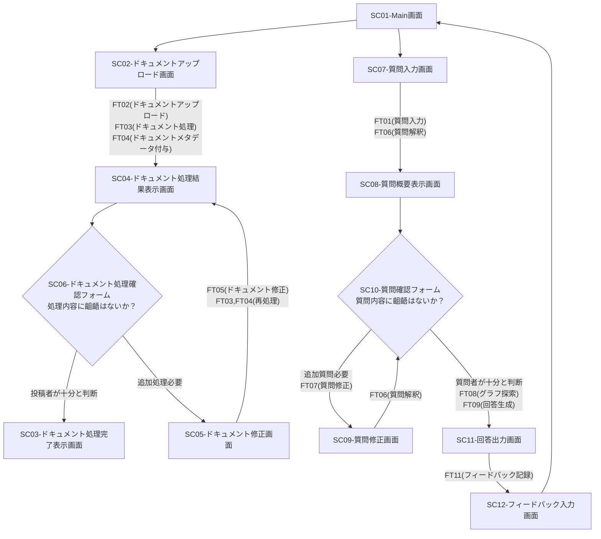

# Overview

- 画面情報と各機能の対応関係を示す
- 主要な画面遷移とユーザーインターフェースの概要を提供

# Screen Flow

# Screen and Feature Mapping
| Screen ID | Screen Name | Screen Description | Related Features |
|-----------|-------------|--------------------|------------------|
| SC01 | Main画面 | システムのメイン画面。ドキュメントアップロードや質問入力へのナビゲーションを提供。 | |
| SC02 | ドキュメントアップロード画面 | ユーザーがドキュメントをアップロードするための画面。 | FT02 |
| SC03 | ドキュメント処理完了表示画面 | ドキュメントの処理が完了したことを通知する画面。 | FT03, FT04 |
| SC04 | ドキュメント処理結果表示画面 | 処理されたドキュメントの要約やメタデータを表示する画面。 | FT03, FT04 |
| SC05 | ドキュメント修正画面 | ユーザーがドキュメントの内容を修正できる画面。 | FT05 |
| SC06 | ドキュメント処理確認フォーム | ユーザーがドキュメント処理の内容を確認し、必要に応じて追加処理を指示する画面。 | FT03, FT04, FT05 |
| SC07 | 質問入力画面 | ユーザーが質問を入力するための画面。 | FT01 |
| SC08 | 質問概要表示画面 | 入力された質問の解釈結果を表示する画面。 | FT06 |
| SC09 | 質問修正画面 | ユーザーが質問内容を修正できる画面。 | FT07 |
| SC10 | 質問確認フォーム | ユーザーが質問内容を確認し、必要に応じて追加質問を指示する画面。 | FT06, FT07, FT08 |
| SC11 | 回答出力画面 | 生成された回答と引用元情報を表示する画面。 | FT09, FT10 |
| SC12 | フィードバック入力画面 | ユーザーが回答に対するフィードバックを入力する画面。 | FT11 |
